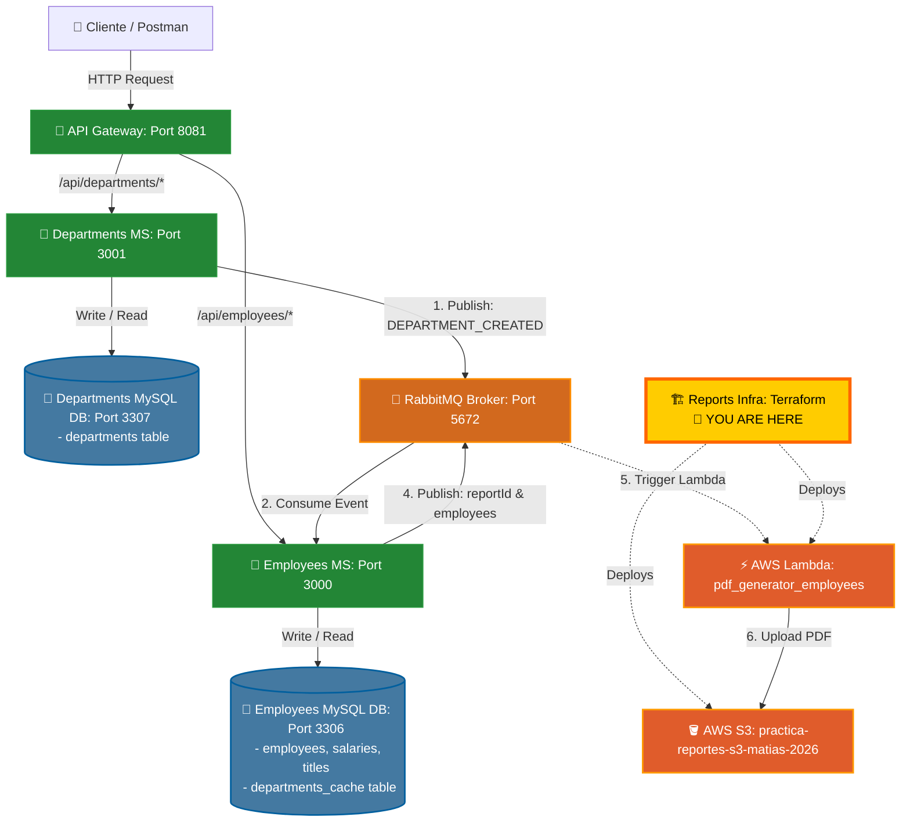

# Infraestructura de Reportes de Empleados (`reports_infra_employees`)

Este directorio contiene la configuración de **Terraform (Infraestructura como Código - IaC)** necesaria para desplegar la infraestructura serverless en AWS destinada a la generación y almacenamiento de reportes PDF de empleados.

---

## 🔗 Connected Repositories

This project belongs to a multi-repository microservices ecosystem. Ensure you have all repositories cloned for full integration:

*   **API Gateway:** [employees_api_gateway](https://github.com/MNATorres/employees_api_gateway.git)
*   **Departments Microservice:** [departments_ms](https://github.com/MNATorres/departments_ms.git)
*   **Employees Microservice:** [employees_ms](https://github.com/MNATorres/employees_ms.git)
*   **PDF Generator (AWS Lambda):** [pdf_generator_employees](https://github.com/MNATorres/pdf_generator_employees.git)
*   **Reports Infrastructure (Terraform - This repo):** [reports_infra_ms](https://github.com/MNATorres/reports_infra_ms.git)

---

## 🏗️ Arquitectura de la Infraestructura

El despliegue con Terraform aprovisiona la infraestructura serverless en AWS para la generación y almacenamiento de reportes PDF.



El despliegue con Terraform aprovisiona los siguientes recursos en AWS:

1. **Amazon S3 (`practica-reportes-s3-matias-2026`)**:
   - Un bucket S3 configurado con acceso público de lectura (`s3:GetObject`).
   - Sirve como almacenamiento permanente para los archivos PDF generados por la función Lambda, permitiendo que cualquier cliente web o usuario acceda a ellos a través de una URL pública.
   
2. **AWS Lambda (`generador-reportes-pdf`)**:
   - Función Lambda basada en **Node.js 18.x** con un tiempo de espera (timeout) de 30 segundos.
   - Empaqueta de forma automática el código fuente del microservicio hermano [pdf_generator_employees](file:///c:/Users/matia/OneDrive/Desktop/apps/microservicio_practice/pdf_generator_employees) en un archivo `.zip` para subirlo a AWS.
   - Recibe como variable de entorno el nombre del bucket de S3 (`BUCKET_NAME`).

3. **IAM Roles y Políticas**:
   - **`lambda_reportes_role`**: Rol de ejecución para la Lambda.
   - **`AWSLambdaBasicExecutionRole`**: Adjunta la política estándar para permitir a la Lambda escribir logs de ejecución en Amazon CloudWatch.
   - **`lambda_s3_write_policy`**: Política personalizada que permite a la Lambda escribir objetos (`s3:PutObject` y `s3:PutObjectAcl`) únicamente en el bucket de reportes creado.

---

## 📁 Estructura de Archivos

* [main.tf](file:///c:/Users/matia/OneDrive/Desktop/apps/microservicio_practice/reports_infra_employees/main.tf): Archivo principal de configuración de Terraform que define los proveedores, recursos (S3, Lambda, IAM) y la compresión del paquete Lambda.
* `.terraform.lock.hcl`: Archivo de bloqueo de dependencias de proveedores de Terraform.
* `lambda_dummy.zip`: Archivo temporal para inicializaciones previas.

---

## 🛠️ Requisitos Previos

Antes de desplegar, asegúrate de tener instalado y configurado:

1. [Terraform CLI](https://developer.hashicorp.com/terraform/downloads) (v1.0.0+ recomendado).
2. [AWS CLI](https://aws.amazon.com/cli/) instalado y configurado con credenciales válidas (`aws configure`).
3. Las dependencias del generador de PDF instaladas localmente para que se incluyan en el despliegue de la Lambda:
   ```bash
   cd ../pdf_generator_employees
   npm install
   ```

---

## 🚀 Instrucciones de Despliegue

Sigue estos pasos desde el directorio `reports_infra_employees`:

1. **Inicializar Terraform**:
   Prepara el directorio instalando los proveedores necesarios (en este caso, el proveedor de AWS).
   ```bash
   terraform init
   ```

2. **Planificar Cambios**:
   Verifica qué recursos se van a crear, modificar o destruir en tu cuenta de AWS.
   ```bash
   terraform plan
   ```

3. **Aplicar Despliegue**:
   Aplica los cambios en AWS. Terraform te pedirá confirmación escribiendo `yes`.
   ```bash
   terraform apply
   ```

4. **Destruir Infraestructura (Opcional)**:
   Si necesitas eliminar todos los recursos creados para evitar costos:
   ```bash
   terraform destroy
   ```

---

## 📥 Integración e Invocación de la Lambda

### Payload de Entrada (Event JSON)
La función Lambda puede ser invocada de forma directa o a través de RabbitMQ. Espera recibir un JSON con la lista de empleados y un identificador para el reporte:

```json
{
  "reportId": "reporte-anual-2026",
  "employees": [
    {
      "id": 101,
      "name": "Matias Torres",
      "role": "Cloud Architect & Dev"
    },
    {
      "id": 102,
      "name": "Ana Gómez",
      "role": "Lead Backend Engineer"
    }
  ]
}
```

*Nota: Si el evento contiene una propiedad `body` (como los eventos estructurados de API Gateway o colas de mensajería), la Lambda automáticamente parseará el contenido de `body`.*

### Respuesta de Salida (Output JSON)
Cuando la generación es exitosa, la función responde con un código de estado `200` y la URL pública para descargar el PDF:

```json
{
  "statusCode": 200,
  "body": {
    "status": "COMPLETED",
    "reportId": "reporte-anual-2026",
    "s3Path": "reportes/reporte-anual-2026.pdf",
    "url": "https://practica-reportes-s3-matias-2026.s3.amazonaws.com/reportes/reporte-anual-2026.pdf"
  }
}
```
